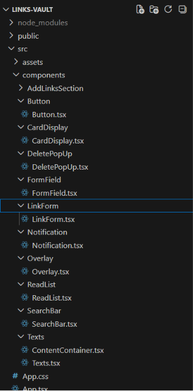
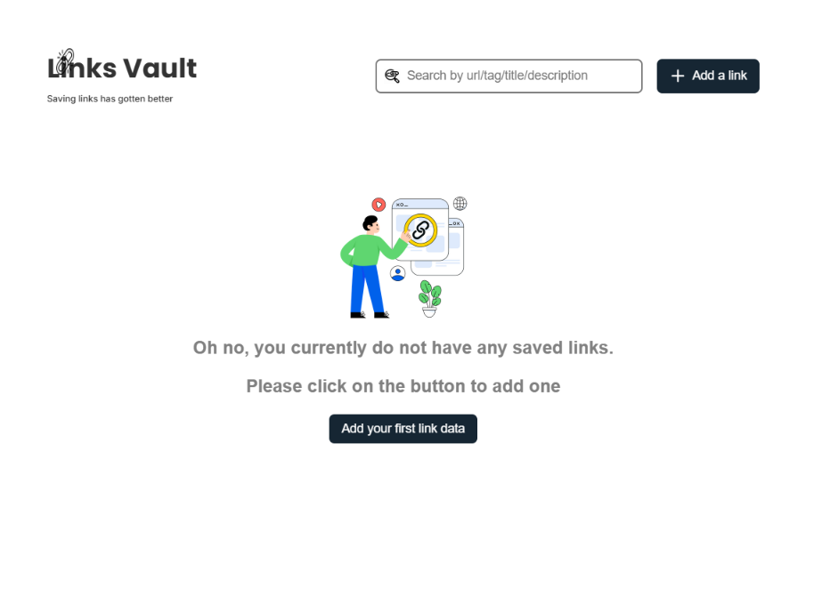

Links Vault

 ## Table of contents
 #Overview
 #Features
 #screenshot(preview)
 #built-with
 #Prerequisites
 #acknowledgements

### Overview

Links Vault is a React + TypeScript app for saving, organizing, and searching links. Add a link with a title, description, and tag, then find it again later with the search bar .Everything is stored locally in your browser.

### Features
-Add links with a title, URL, description, and an optional tag (Favourites, Work, Personal, School etc)
-Edit and delete saved links, with a confirmation pop up before deleting
-Search across title, URL, description, and tag
-Persistent storage via localStorage so your links are still there when you refresh or come back later
-Empty state with an illustration and action required when you have no saved links yet
-Form validation for required fields, title/description length limits, and URL format
-Toast notifications for add/update/delete actions
-Responsive layout that adapts down to small mobile screens

### built -with
Tech Stack
React 
TypeScript
Vite — build tool and dev server
Plain CSS 
Browser localStorage for persistence

Project Structure

### screenshot
![preview] (./src/assets/pictures/preview.png)

### Prerequisites
Node.js (LTS version recommended)
npm (comes with Node.js)

This starts Vite's dev server (with hot reload) — open the printed local URL in your browser.

Build for production
bash
npm run build

Preview the production build
bash
npm run preview

Links are stored under the list key in the browser's localStorage as a JSON array. 
Live demo:https://karabo-link-vault-web-app.netlify.app/

## Acknowledgments
https://youtu.be/IQ9ZZbrp04Y?si=N7YQMGpTatvac7wV
https://youtu.be/SOnMln3W0U8?si=rFwZ33tqU3to1Eb9